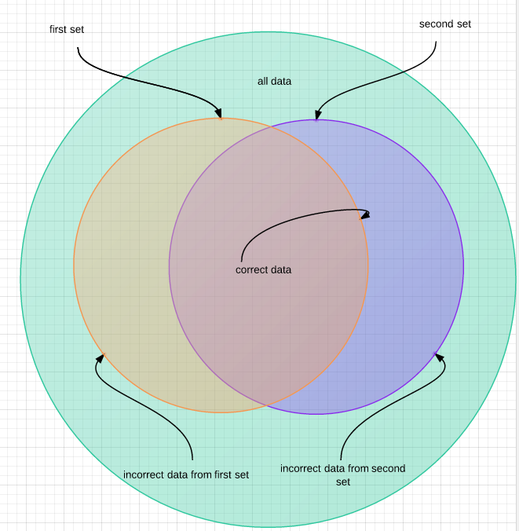

Symmetric conventions will verify a convention and also the inverse of that convention.

An example of a symmetric convention is `ClassTypeHasSpecificNamespace`. It can verify a particular class type (dto, domain object, event handler) lives in a certain namespace, but it will also verify that ONLY that class type lives in that namespace. 

Take a look at the following Venn Diagram

In the above example, let us say 'Dtos must live under Project.Dtos'. This means that all data contains ALL TYPES in the assembly, correct data is a dto living in the Project.Dtos namespace. But we have two failure conditions.

The first is if a Dto is outside the Project.Dtos namespace, the convention fails. The second is if a non-dto class lives inside the Project.Dtos namespace.

### How to use a symmetric convention

    var types = new Types("Types in MyProject")
    {
        TypesToVerify = typeof(MyDto).Assembly.GetTypes()
    };
    var convention = new ClassTypeHasSpecificNamespace(
        classIsApplicable: t => t.Name.EndsWith("Dto"), 
        namespaceToCheck : "MyProject.Dtos", 
        classType: "Dto");
    Convention.Is(convention, types);
    
As you can see, symmetric conventions are no different to enforce

### Writing a symmetric convention
See [Defining Conventions](DefiningConventions.html)